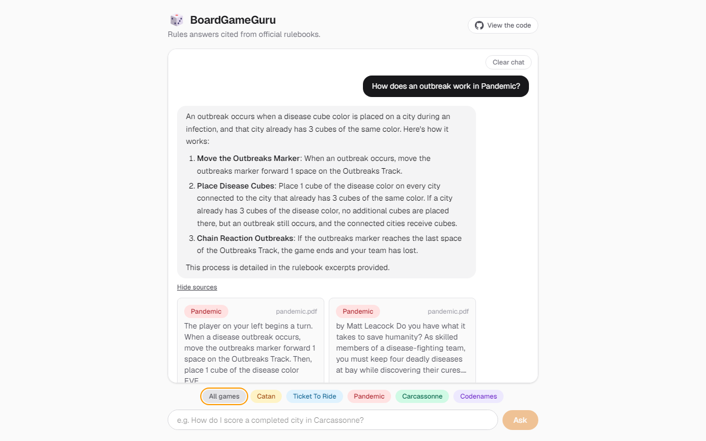
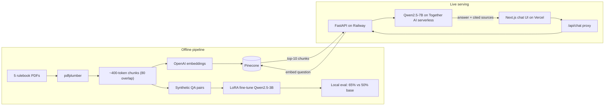

# BoardGameGuru

A RAG chatbot that answers natural-language questions about board game rules, grounding every answer in official rulebook text with cited sources.

**Live demo: https://board-game-guru.vercel.app**



Covers five games: Catan, Ticket to Ride, Pandemic, Carcassonne, and Codenames — 134 chunks of rulebook text in total.

## Highlights

- **End-to-end RAG pipeline** — rulebook PDFs are extracted with pdfplumber, split into ~400-token chunks with 80-token overlap, embedded with OpenAI `text-embedding-3-small`, and stored in Pinecone. At query time the top 10 chunks ground a Qwen2.5-7B answer, and the UI cites the best 4 of them so the reader can check the answer against the rulebook.
- **Fine-tuning with a measured result** — Qwen2.5-3B-Instruct was LoRA fine-tuned (Together AI) on 76 synthetic QA pairs generated from the rulebooks. On a 20-question held-out eval graded by an LLM judge, the fine-tuned model scored **65% correct vs 50% for the base model** under identical conditions.
- **Cost-driven deployment tradeoff** — Together AI requires a $6.49/hr dedicated endpoint to serve fine-tuned models, which isn't viable for an always-on demo. Live traffic is served by a confirmed-serverless base model, while the fine-tuned adapter was downloaded and evaluated offline. The eval quantifies exactly what that tradeoff costs in answer quality.
- **Corpus-validated display filtering** — some rulebook PDFs extract with scrambled glyph order (reversed words, interleaved map labels). The source-citation filter's heuristics were validated against every chunk in the corpus, not spot-checked.

## Architecture



## Fine-Tuning Eval

20 held-out questions across all 5 games. Each model received the same single retrieved chunk as context, and an LLM judge graded correctness against that chunk.

| Model | Correct |
|---|---|
| Qwen2.5-3B-Instruct (base) | 10/20 (50%) |
| Qwen2.5-3B-Instruct + LoRA | **13/20 (65%)** |

The fine-tuned model stays on-topic where the base model drifts or hedges. Both models missed 4 of the same questions identically — the comparison isn't cherry-picked, and one case shows fine-tuning increasing confidence without guaranteeing accuracy. Summary in `backend/eval/grading_summary.json`; methodology and caveats in `backend/pipeline/finetune/eval_results.md`.

## Stack

| Layer | Tech |
|---|---|
| Backend | FastAPI (Python), deployed on Railway |
| Frontend | Next.js + Tailwind CSS, deployed on Vercel |
| Retrieval | Pinecone + OpenAI `text-embedding-3-small` |
| Generation | Qwen2.5-7B-Instruct-Turbo (Together AI serverless) |
| Fine-tuning | LoRA on Qwen2.5-3B-Instruct (Together AI), evaluated locally |
| PDF parsing | pdfplumber |

## Local Development

> **Note on the corpus:** the rulebook PDFs and every derived artifact containing
> verbatim rulebook text (chunk cache, QA pairs, per-question grading output) are
> gitignored — they're copyrighted. A fresh clone runs, but you supply your own
> PDFs in `backend/documents/` and build your own index. Everything that can be
> published without redistributing that text is committed, including the eval
> summary and all pipeline code.

### Backend
```
cd backend
python -m venv venv
source venv/Scripts/activate  # Windows Git Bash
pip install -r requirements.txt
cp ../.env.example .env  # fill in OpenAI / Pinecone / Together keys
uvicorn app.main:app --reload
```

### Building the index
With PDFs in `backend/documents/`, this extracts → chunks → embeds → upserts in
one pass, creating the Pinecone index (1536-dim, cosine) if it doesn't exist yet:
```
cd backend
python -m pipeline.embed
```
Game names are derived from filenames, so `ticket_to_ride.pdf` becomes the
`Ticket To Ride` filter value.

### Frontend
```
cd frontend
npm install
cp .env.local.example .env.local  # points BACKEND_URL at the local backend
npm run dev
```

### Fine-tune evaluation (optional, local only)
Comparing the LoRA adapter against the base model requires PyTorch/transformers/peft,
which the deployed backend never needs — kept in a separate venv:
```
cd backend/pipeline/finetune
py -3.11 -m venv eval_venv
source eval_venv/Scripts/activate
pip install -r eval-requirements.txt
python eval_adapter.py  # writes eval_results.md
```

### Live-endpoint smoke eval
`backend/eval/run_eval.py` runs all 20 test questions against a running `/query` endpoint
(`BACKEND_URL=<url> python eval/run_eval.py`). Last run against the deployed backend:
20/20 grounded answers, 2.33s average latency.

<details>
<summary><strong>Deployment notes</strong> (Railway/Nixpacks quirks, CORS)</summary>

- **Backend:** Railway (Nixpacks). Build/start commands are pinned in `nixpacks.toml` at the repo root, since `backend/requirements.txt` isn't at the repo root and Nixpacks only auto-detects a Python app there. A plain `nixPkgs = ["python311", "python311Packages.pip"]` setup also fails (`python -m pip` → "No module named pip"), because that package installs into a separate Nix store path from the interpreter's own site-packages. The working fix creates a venv via `python -m venv` (which bundles `ensurepip`), sidestepping the cross-package site-packages mismatch.
- **Frontend:** Vercel, with **Root Directory** set to `frontend` (monorepo) and `BACKEND_URL` pointing at the Railway domain.
- **CORS:** `CORS_ORIGINS_RAW` on the backend is a comma-separated list (parsed into a list at runtime), e.g. `http://localhost:3000,https://board-game-guru.vercel.app`. Not strictly load-bearing for the deployed app itself — the frontend's `/api/chat` route proxies server-side, so the browser never calls Railway directly — but keeps the API directly callable/testable.

</details>

## Project Structure

```
backend/
  app/
    config.py            Pydantic settings (models, keys, CORS)
    main.py              FastAPI app + CORS
    routes/query.py      POST /query — question + optional game filter
    rag/retriever.py     Embed query → Pinecone top-k
    rag/generator.py     Grounded answer from retrieved chunks
  pipeline/
    ingest.py            pdfplumber text extraction
    chunk.py             400-token chunks, 80-token overlap
    embed.py             Embed + upsert; entrypoint for the whole pipeline
    finetune/            QA generation, LoRA job submission, adapter eval
  eval/
    test_queries.json    20 held-out questions
    grade_answers.py     LLM-judge grading of base vs fine-tuned
    run_eval.py          Smoke eval against a live /query endpoint
frontend/                Next.js chat UI (see frontend/README.md)
nixpacks.toml            Railway build config (see deployment notes)
```

`planning.md` has the full phase-by-phase roadmap and the decision log behind the
tradeoffs described above.

## Known Limitations

Honest about what this doesn't do:

- **No reranking.** Retrieval is a single dense-vector pass. `top_k` was raised
  from 5 to 10 after a test question's relevant chunk ranked 14th — a reranker is
  the right fix, `top_k` was the cheap one.
- **Cross-game bleed-through.** With no `game` filter passed, retrieval can
  surface a chunk from the wrong rulebook. The UI's game badges avoid this in
  practice; the API doesn't enforce it.
- **PDF extraction quality varies.** Several rulebooks have font-encoding quirks
  that scramble character order. This affects citation display (filtered by
  `frontend/lib/textQuality.ts`) and put 4 unusable QA pairs into the fine-tuning
  set, which were removed by manual review.
- **The eval is small.** 20 questions, one LLM judge, single-chunk context. It's
  enough to show a directional difference between base and fine-tuned, not enough
  for a confidence interval.

## License

[MIT](LICENSE)
